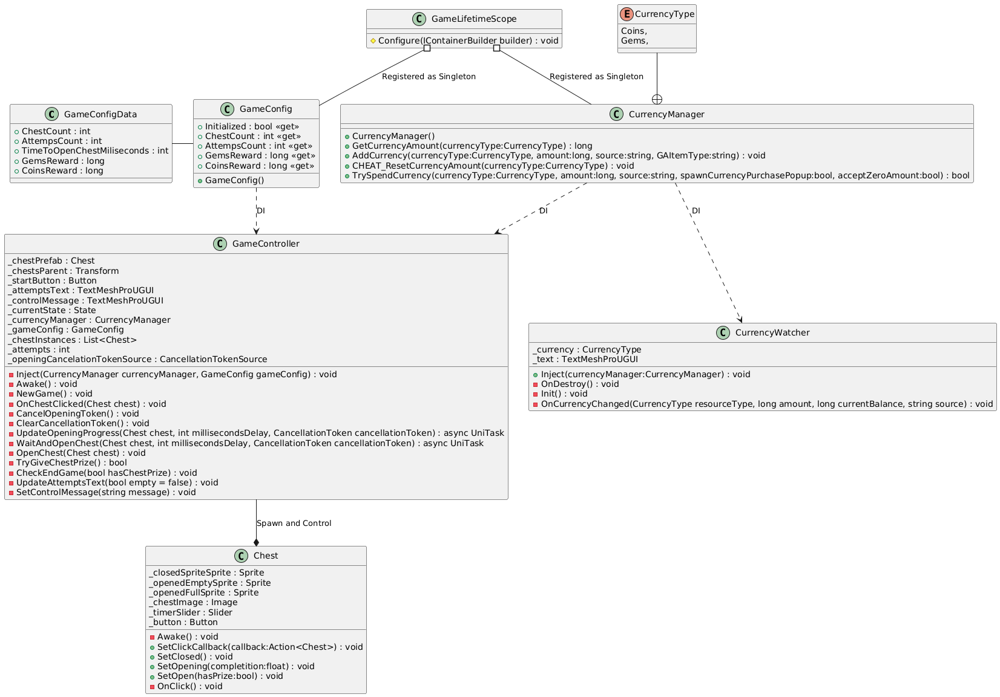

# ChestGame README

Project made in Unity 6000.3.3

## 1. High-Level Architecture

The project was created to demonstrate a simple usage of Async operations. It uses <a href="https://github.com/Cysharp/UniTask">UniTask</a> for easy async operations, <a href=https://github.com/hadashiA/VContainer>VContainer</a> for Dependency Injection, and <a href="https://gitlab.com/tn-asset-library/resource-bank">Resource Bank</a> for the currencies of the game.

The project-specific files can be found at `Assets/_Project`.

`Assets/_Project/Scripts/Gameplay/GameController.cs` is the main point of entry, where it controls the instantiation and states of each chest, gives rewards when needed, and controls the number of attempts. It depends on `Assets/_Project/Scripts/Config.GameConfig.cs` for config values, and `Assets/_Project/Scripts/Currency/CurrencyManager.cs` for currency handling.

The dependencies are added at `Assets/_Project/Scripts/Core/GameLifetimeScore.cs`.

`Assets/_Project/Scripts/UI/CurrencyWatcher` displays the current state of the currencies, and is updated by events.

## 2. Key Design Decisions

1. The use of libraries to speed up the development. UniTask eases the handle of async operations, VContainer the management of references and overall project structure, and Resource Bank to speed up the development of a currency manager. This decision was made to speed up development and increase reliability

2. On `GameController` the handle of the opening state was unnecessarily split into two tasks. This decision was made for both, demonstrate how to handle multiple async operations running in parallel, and also to create a visual feedback of the chest state. 

3. `GameConfig` is loading a local JSON file with the config values to simulate a server call

More specific reasoning is written above key parts inside the scripts

## 3. Instructions to Build and Run

* Change the target build to Android

No further specific instruction needed. The project was validated on Editor and Android build, targeting 1080x1920 Portrait, with Landscape validated to be working. The regular procedures to play in those two platforms can be followed.